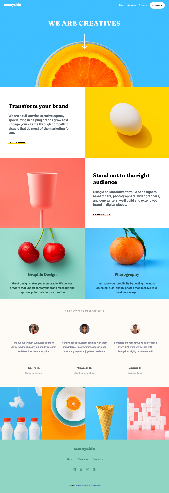
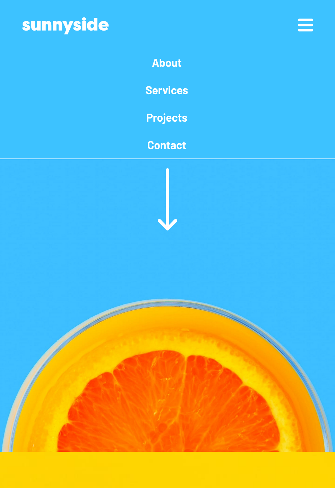
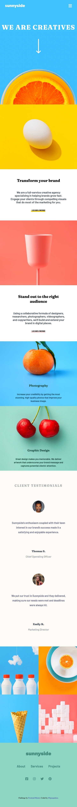

# Project: Sunnyside Creative Agency

## **About Project**

Sunnyside is a full-service creative agency specialized in helping brands grow fast. This project is a landing page for Sunnyside Agency, using 'Frontend Mentor' for inspiration.

[Live Demo](https://lpasqualone.github.io/sunnyside-agency-landing-page/)👈

### **Technologies and Tools Used**

* HTML
* CSS
* JavaScript
* Figma (For reference, product design specifications)

### **Emphasized Concepts**

1. Responsive Web Design

*Process involved:*
  - Taking the desktop first approach for creating the design
  - Making the website scale cleanly on all devices between **1440px to 320px**, viewable for standard laptops to any size mobile device.

*CSS Flexbox and Grid*

*Design changes based on different screen sizes*

*JavaScript for creating responsive mobile menu*
 

## **Summary**

**What I know**
* Confident working with rows, containers for quickly writing code for a replicable webpage template
* Comfortable with responsive design, moving elements around for size/placement shift
* JavaScript for interactive elements

**Where I can grow**
* CSS Grid - I feel confident with Flexbox and comfortable with Grid. Was able to quickly search and apply Grid tactics, but would like to be more well versed off the top of my head.
* More practice working with responsive design. I have a good handle on the process, but would like to be more efficent with experience in time.

## **Screenshots**

***Desktop** 

***Mobile**

<table>
  <tr>
    <td></td>
    <td></td>
  </tr>
 </table>

 

### Links

- [Frontend Mentor Solution](https://www.frontendmentor.io/solutions/sunnyside-agency-landing-page-RjNeWXbeb)
- Author: [@lpasqualone](https://www.frontendmentor.io/profile/lpasqualone)
